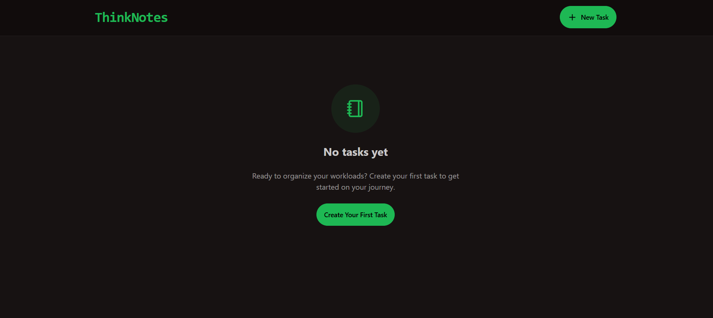
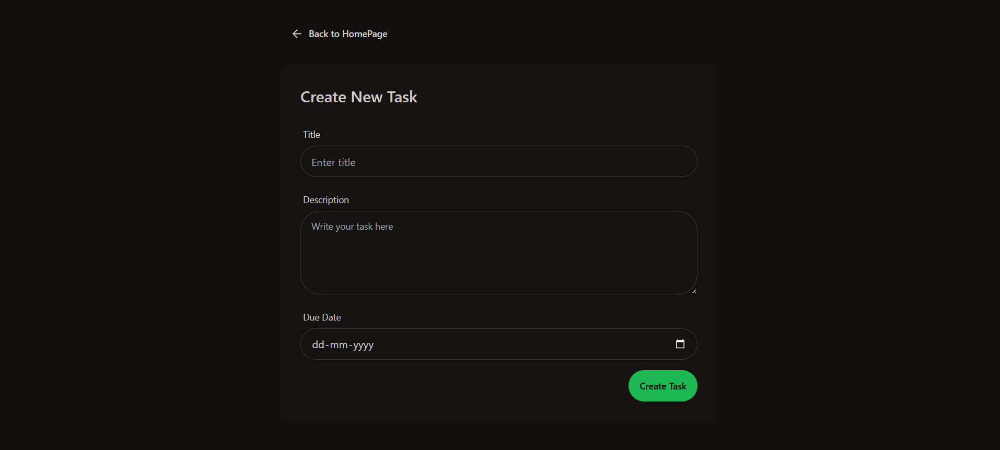
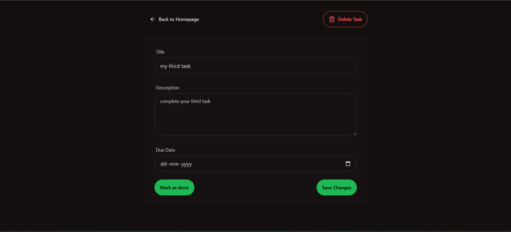

<h1><b>ThinkNotes : A Task Manager</b></h1>

ThinkNotes is an easy-to-use task manager made for looking up to your overall workloads or tasks.
It can create, update and delete tasks according to your inputs and needs and have a very clean UI/UX design.

<h2>*****Frontend*****</h2>

The whole frontend is made using React framework with designs and themes taken from daisyUI.Tailwind CSS was used somewhere for styling.
It has very simple features of:
<ul>
<li>Displaying Tasks
<li>Creating Tasks
<li>Updating Status
<li>Deleting Tasks
</ul>

<h3>Homepage</h3>

<h3>Create Page</h3>

Here you can create your task by adding title, description and Due Date

<h3>Detail Page</h3>

Here you can see the detailed view of your task and can update changes also. If the task is completed you can mark it as done

Finally the Homepage will look like this with all the tasks placed together and their status and due date could be seen easily

